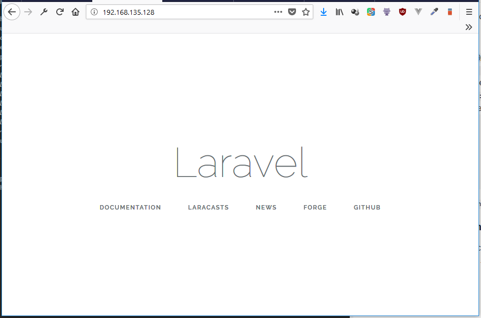
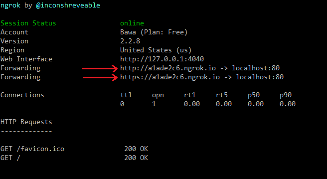
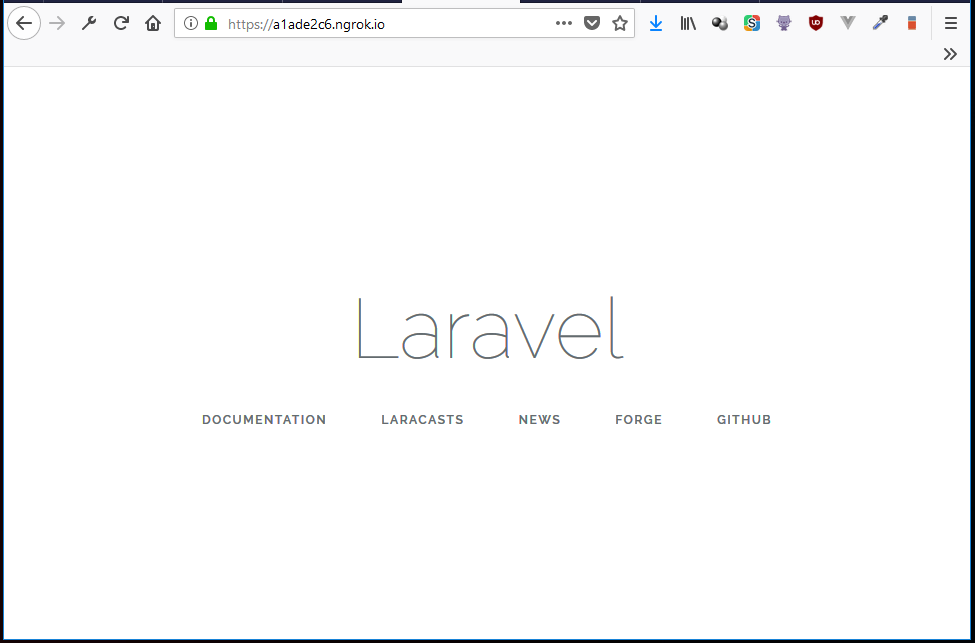
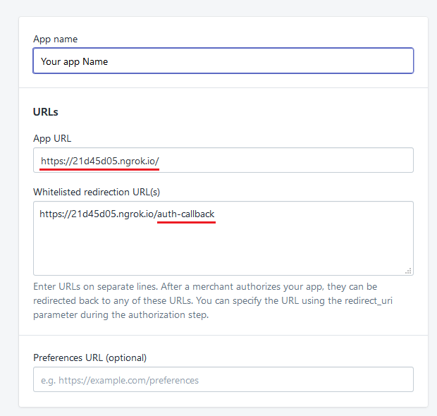
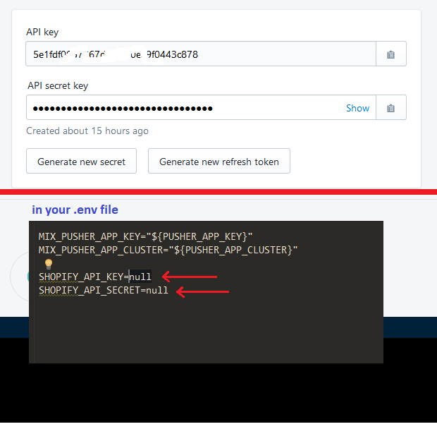
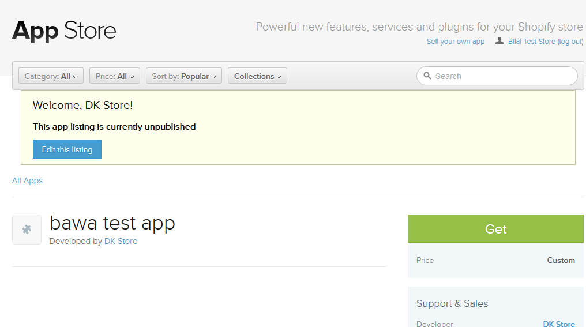
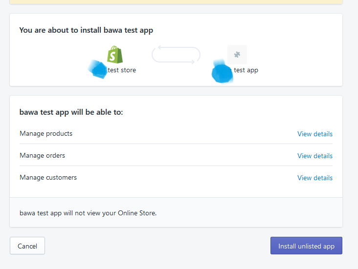
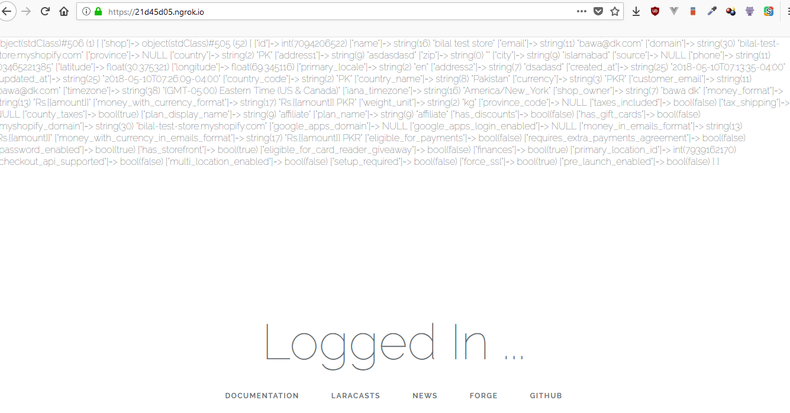
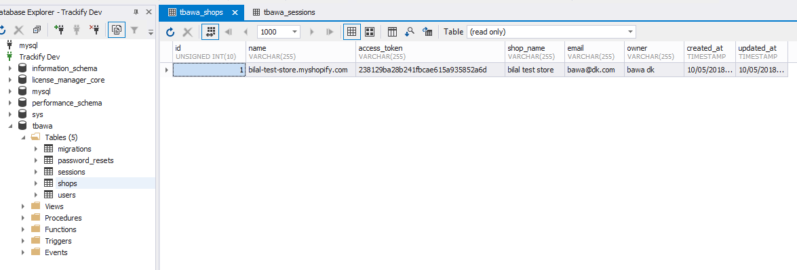

# shopify-laravel

A skeleton application that i wrote to build apps in laravel for shopify.

setup instructions ...

1. checkout via `$ git clone git@github.com:redretarget/shopify-laravel.git`
2. run composer install `composer install`
3. go to the repo root and create env file `cp .env.example .env`
4. generate key `php artisan key:generate`
5. update db details in the env file.
    ~~~
    DB_CONNECTION=mysql
    DB_HOST=127.0.0.1
    DB_PORT=3306
    DB_DATABASE=homestead
    DB_USERNAME=homestead
    DB_PASSWORD=secret
    ~~~
6. run the migrations `php artisan migrate`

the application is a standard laravel 5.6 application with a couple of packages included
to make things easy for development.

1. repositories package by `https://packagist.org/packages/prettus/l5-repository`
2. shopify php package by `https://packagist.org/packages/rocket-code/shopify`

#### Exposing the app to internet

setup the vhost or nginx host in such a way that it is default website of the server.
to check that type your ip in the browser and see what pops up ...

### nginx configuration for default site

~~~
server {
    listen 80 default_server; # <====== listen to port 80
    listen [::]:80 default_server ipv6only=on; #<========== indicating default site

root /var/www/trackify/shopify-laravel/public;
    index index.php index.html index.htm;

server_name shopify-laravel.test;
    charset   utf-8;

... ...
... ...

~~~

Once that is done, we need to make our site discoverable. For this we use [ngrok](https://ngrok.com/)
, head over to ngrok website, download the appropriate platform executable and fire it up ...

in case of linux, we do it like `./ngrok http 80`

and if done correctly, you will see something like this ...

**Note that we need to fireup ngrok everytime our system restarts, as it will be a free
account, so it wont be a permanent tunnel.**

and it should show the same website page which we saw with the ip address ...

we are good to go, lets take care of the shopify config stuff ...

1. Login to your partner account at shopify, and click on apps and then create app button.
2. one the app info page add these URLs accordingly (change website URL to the one you got from ngrok)

    

3. scroll down and copy the auth key and paste it in your env file ...

    
4. add the ngrok URL to `NGROK_URL` env setting as well
5. Click on 'Development Stores' from the left navigation and follow through the steps to create
your development store. We need that to test our app.

### installation in our test store.

1. click on the 'Create App store listing' button bellow the app name.
2. click any of the 'Edit app submission form' buttons, we wont be filling in anything, we
just need to create a dummy listing of our app.
3. hit save button on the right side in the next page.
4. page will refresh and will start showing you 'View app listing' button
5. click that, and you will see the dummy app listing we created. Click the 'Get' button
    
6. it will take you to app install screen where you will be asked for your permission to 
install the unlisted app into your development store. Click 'install unlisted app'.
    
7. if everything went as planned, you will see the 'logged in page'. You can check the 'Shops'
    
table in the database to see the access token obtained, which will be required for later operations.
    

Enjoy ! And happy coding :)

installing app into shopify ...

https://bilal-dev-store.myshopify.com/admin/api/auth?api_key=307ee88264d6cc7f535110c1603bce42